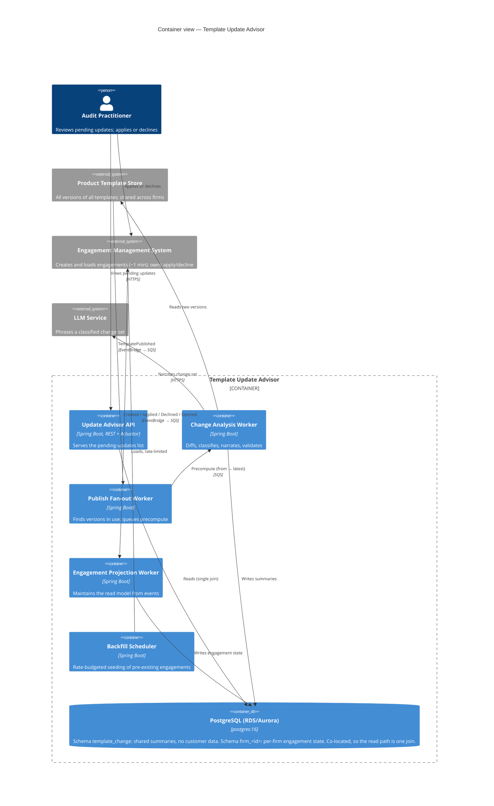

# Pending Template Updates — Design

**The problem.** Firms need to see at a glance which of their ~100s of engagement files have
pending product-template updates, and read a plain-language summary of what each update contains
in order to apply or decline it.

**The constraint that decides everything.** An engagement's current template version is not
queryable; reading it means loading the engagement, at about a minute each. For 300 engagements
that is five hours per firm, per check. So the system may never ask an engagement what version it
is on. It must already know.

## Assumptions

- Template versions are immutable once published. A summary of v3→v4 is therefore correct forever.
- **Declining is deferral, not refusal.** If a user declines v4 and v5 then publishes, the
  engagement is still on v3, so the pending range is v3→v5 — not v4→v5. The declined version is
  shown as context, never used to advance the starting point. This is the subtlest rule here and
  the one most likely to be got wrong.
- The engagement management system can emit an event within the transaction that changes state
  (an outbox), so events are not lost on crash.
- Firms number in the thousands, engagements per firm in the hundreds, template publishes about
  weekly per product. Nothing about this is high-throughput.

## 1. High-Level Architecture

Two planes, deliberately separated by what they know about.

**The global plane is firm-independent.** A diff between two template versions is byte-identical
for every customer on earth. So on `TemplatePublished`, one worker computes the diff, classifies
it into typed change records, narrates it, validates the narration, and stores the result keyed by
`(template_id, from_version, to_version)` — no firm, no engagement. One computation serves the
entire customer base, and a single content-team review of that summary covers everyone. This is
safe to share precisely because it derives from template content and never touches engagement
data; the schema has no column in which a firm identifier could be recorded even by mistake.

**The tenant plane is a projection.** The engagement management system is the *sole writer* for
all three transitions that can change an engagement's template version — creation, apply, decline.
Hook those three and the resulting read model is exact, not an estimate. `engagement_template_state`
is then a millisecond query instead of an hour of loading.

**Fan-out on publish is demand-driven.** `SELECT DISTINCT current_version WHERE template_id = ?`
returns exactly the versions engagements actually sit on — typically a handful. Summaries are
precomputed for those pairs only, so the version matrix never explodes combinatorially.

**Accumulation takes the net diff.** An engagement on v3 with v4, v5, v6 published gets the direct
v3→v6 diff, not three composed summaries. Composition contradicts itself: a field added in v4 and
removed in v6 would be reported as both. The practitioner decides on the net change, so that is
what is computed.

Full C4 set — context, container, the two component views, and code — is in `DIAGRAMS.md`.

## 2. Implementation Plan

- **P0** — Event contracts and a transactional outbox in the engagement system. Flyway baseline.
- **P1** — Projection and backfill. Pre-existing engagements have no event history, so seed them
  lazily when a user opens one anyway, plus a background sweep on a strict rate budget that never
  competes with interactive loads. Until an engagement is seeded the UI says "checking", which is
  honest, rather than "up to date", which would be a guess.
- **P2** — Diff, classifier, and **deterministic rendering, shipped before any model**. A plain
  categorised list already answers the user's question. AI is an enhancement here, not a
  dependency, and building in this order proves it.
- **P3** — Narration, validation, and an SME review queue.
- **P4** — Dashboard read API and badges.

## 3. Testing Strategy

Written test-first; the rules are easier to state as executable examples than as prose, and the
tests become the specification. Coverage is gated in the build at 95% line and branch (currently
98.1% and 96.5%); what remains uncovered is named in the README rather than quietly tolerated.

- **Rules as tables** — accumulation, the decline rule, no-op, out-of-order and duplicate events.
- **Adversarial narration** — a stub returns hallucinated output on purpose, proving the validator
  catches it rather than assuming it would.
- **Real PostgreSQL, not H2.** The schema depends on `jsonb`, integer arrays, `ON CONFLICT`
  upserts and check constraints. A substitute that approximates those lets a test pass while
  production fails. Testcontainers runs `postgres:16` and Flyway applies the real migrations, so
  the migrations are tested by being executed on every run.
- **No live model in CI.** It is neither deterministic nor cheap; it is stubbed behind an
  interface and exercised in a separate scheduled evaluation job. Postgres, being both, is real.

## 4. Evaluation & Observability

*System.* The load-bearing metric is `projection.drift.detected`: when a user opens an engagement,
the engagement system already holds the true version in memory, so emitting it costs nothing and
directly measures whether projecting state — the premise of the whole design — is holding. Also
event lag, `summary.cache.hit` (the shared-summary argument, in numbers), precompute p99, backfill
budget consumption, queue depth.

*AI.* Because every sentence cites change-record ids, two of the three quality questions are
mechanical rather than subjective: **coverage** (is every change mentioned?) and **fidelity** (does
any claim lack a basis in the diff?) are checked in code, on every summary, not sampled. Only
readability needs human judgement. Beyond that: an SME-reviewed golden set gates prompt and model
changes, and the strongest real-world signal is the **SME edit rate** on generated summaries.

## 5. Failure Modes & Tradeoffs

- **A dropped event** leaves the projection stale. It self-heals: opening an engagement re-emits
  the true version. Ordinary user traffic is the repair mechanism, with a low-rate audit sweep
  behind it. This buys bounded staleness rather than guaranteed consistency — acceptable when
  updates arrive weekly.
- **The model is unavailable, or invents something.** Fall back to the deterministic rendering.
  Degrade, never block: a practitioner mid-decision is never left waiting on a language model.
  Fallback output is deliberately *not* cached, so a transient outage degrades one request instead
  of permanently seeding a plainer summary for every firm on that version pair.
- **Backfill starving interactive loads** — hard rate budget against the one-minute constraint.
- **PostgreSQL over a key-value store.** Chosen for leverage this workload genuinely uses:
  `SELECT DISTINCT` for fan-out, one join for the read path instead of an application-level join
  across two stores, real constraints, migrations, transactions. The cost is that writes bound to
  a single primary and tenancy must be modelled deliberately rather than falling out of a
  partition key. At weekly publishes and hundreds of engagements per firm that ceiling is nowhere
  near binding — but it would be the wrong call at a volume this problem does not have.

## AI Usage

The division of labour is the design. A model decides **only how to phrase** an already-derived
set of changes. It never determines *whether* an update exists (the projection does, deterministically),
never determines *what* changed (the diff does), and never recommends apply or decline — that is
professional judgement, and the brief is explicit that AI augments practitioners rather than
replacing them.

Everything it produces is checked against the diff before a practitioner sees it: no citation of a
change that does not exist, no change left unmentioned, no figure without a basis. Those checks are
mechanical, and no model judges another model's output. Where AI should not be trusted in this
domain is exactly where it is given no authority: materiality, regulatory significance, and the
decision itself.
