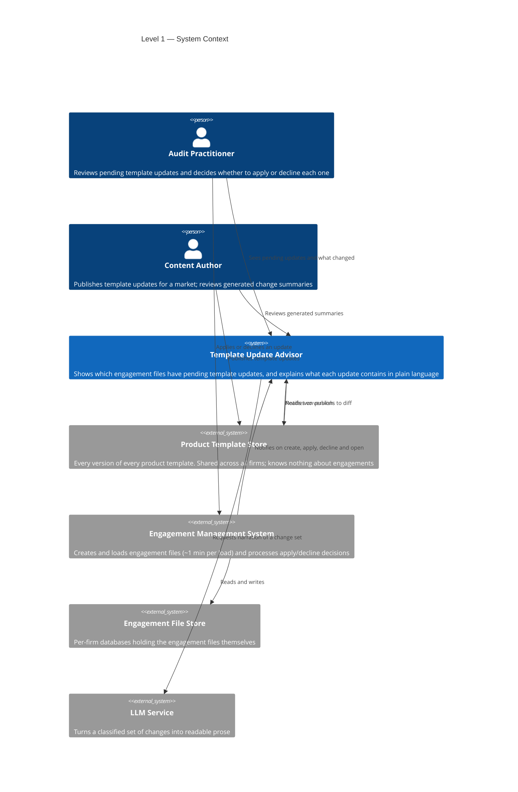
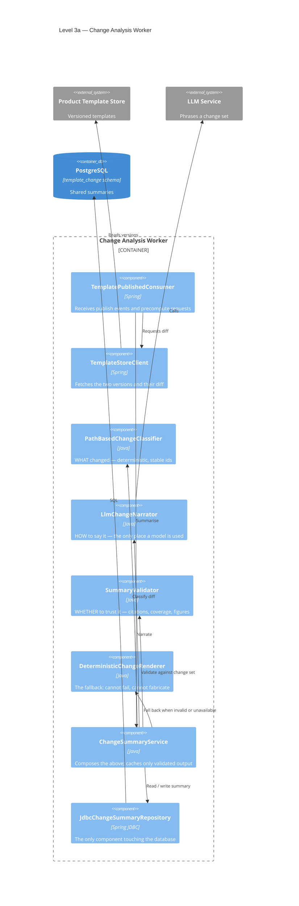
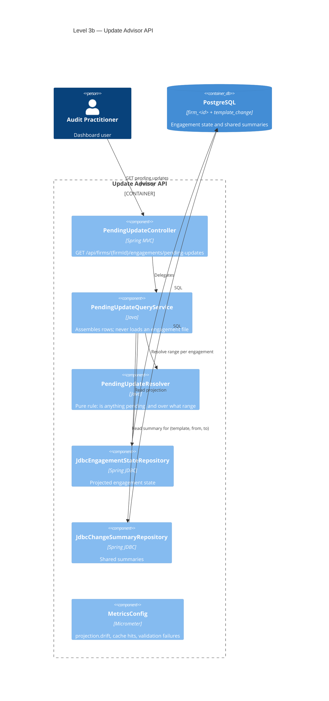
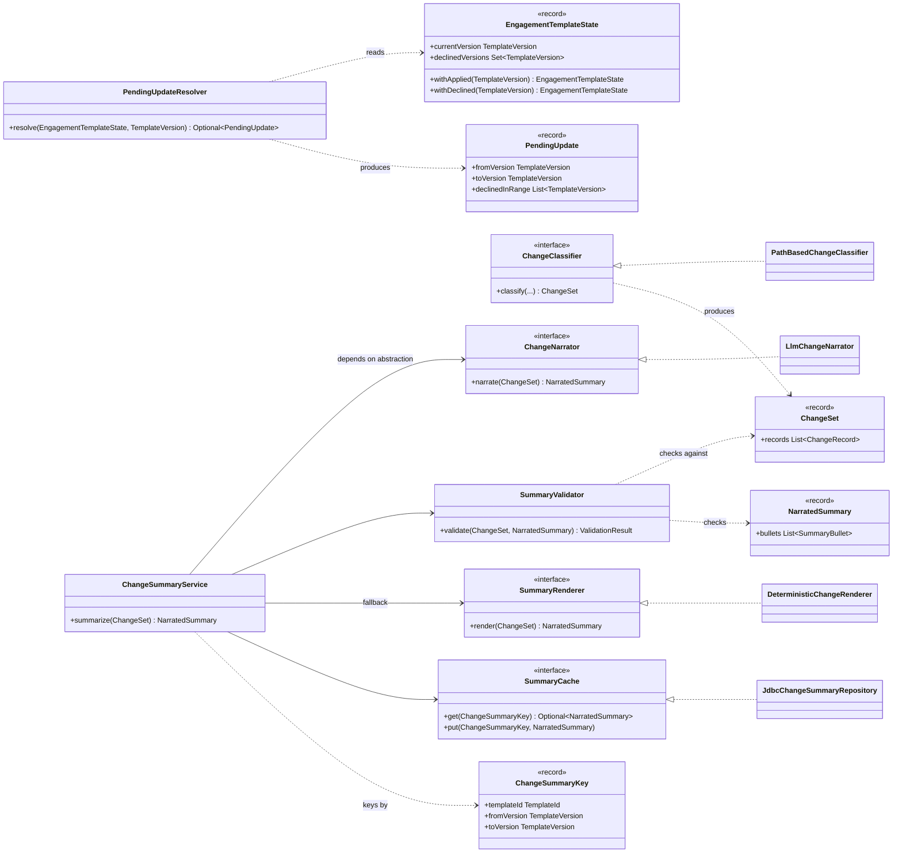

# C4 Diagrams — Template Update Advisor

The four C4 levels for this system. They live here rather than in `DESIGN.md` because the design
document is capped at three pages and the brief lists diagrams as a separate deliverable; only the
container view is repeated there, beside the prose it supports.

Each level answers a different question, and none repeats the level above:

| Level | Question | Audience |
|---|---|---|
| 1 · Context | What is this system, and what does it touch? | Anyone |
| 2 · Container | What are the deployable pieces and the data stores? | Engineers, ops |
| 3 · Component | What is inside the pieces that carry the argument? | Engineers |
| 4 · Code | How does the implemented slice hang together? | Reviewers of this submission |

---

## Level 1 — System Context

The point of this view is the **tenancy split**. The Advisor deliberately straddles a
firm-independent zone (template content, shared by everyone) and a per-firm zone (engagement
state, isolated per customer). Almost every decision in the design follows from keeping those
two apart.

Note what is **absent**: no arrow from the Advisor to the Engagement File Store. The Advisor never
reads an engagement file. That absence is the design.

---

## Level 2 — Container

Both schemas sit in one PostgreSQL cluster. That co-location is what allows the read path to be a
single join rather than an application-level join across two stores, and it is the detail worth
looking for in this diagram.

See `DESIGN.md` for this diagram in context; it is not duplicated here.

---

## Level 3 — Component

Two containers carry the architectural argument, so both get a component view.

### 3a — Change Analysis Worker (global plane)

Four collaborators, each answering exactly one question. The separation is not decoration: it is
what confines a language model to phrasing, and what makes "the model invented something" a
detectable condition rather than a risk to be hoped away.

### 3b — Update Advisor API (tenant plane)

In both views the JDBC adapters are the only components touching the database. That is the
ports-and-adapters split drawn out: the rules in the middle have no infrastructure dependency,
which is why they are testable without any.

---

## Level 4 — Code

C4 normally treats this level as optional and rarely worth maintaining, because it drifts from the
code within weeks. It earns its place here for one reason: it describes code that actually exists
in this submission, so it is the bridge between the design and Part 2 rather than an aspiration.

Two things this view is meant to make obvious.

`ChangeSummaryService` points only at interfaces. No language-model client is constructed anywhere
in the core, which is why the whole summarisation path is testable offline — the SOLID argument
and the coverage figure are the same decision seen twice.

`ChangeSummaryKey` holds a template and two versions and nothing else. There is no firm and no
engagement in it, and there is no column for one in the table behind it. The claim that summaries
are safe to share across customers is enforced by the type and by the schema, not by a convention
someone has to remember.
